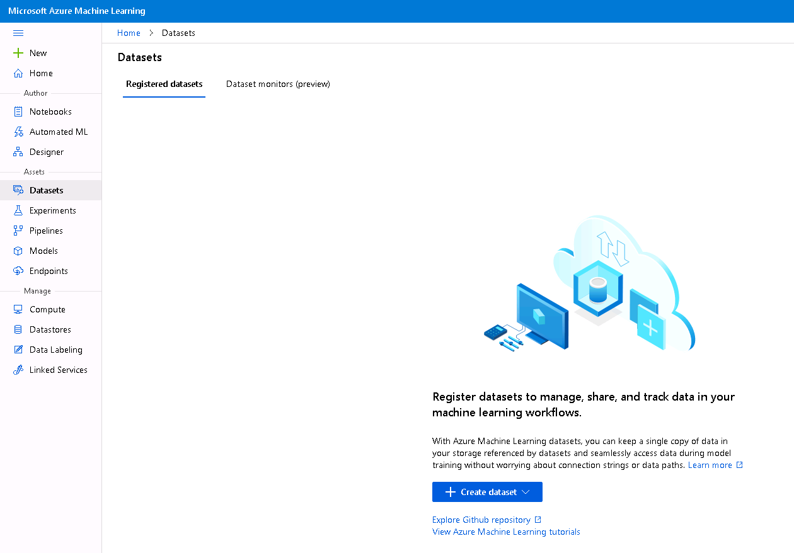
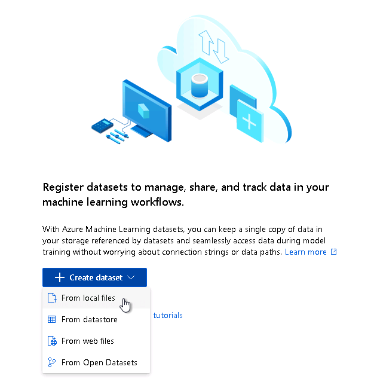
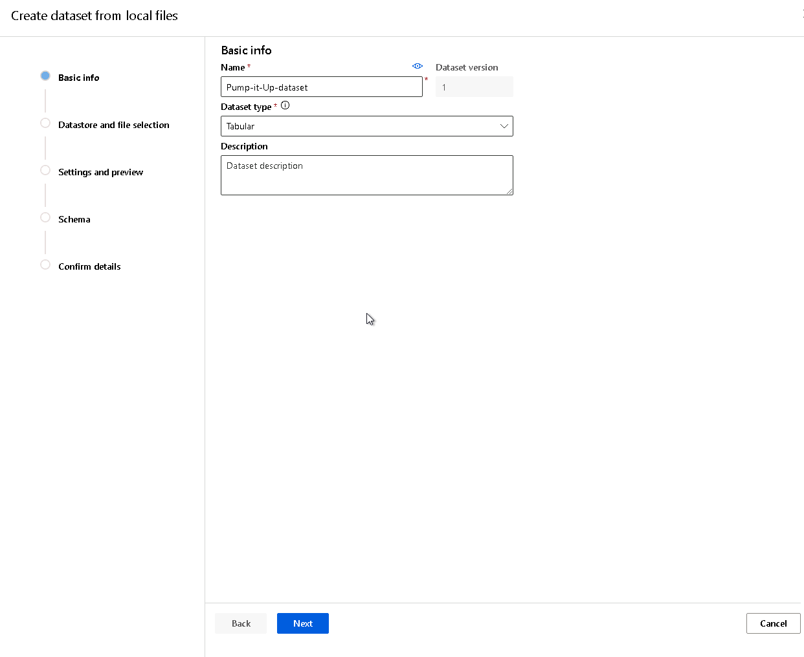
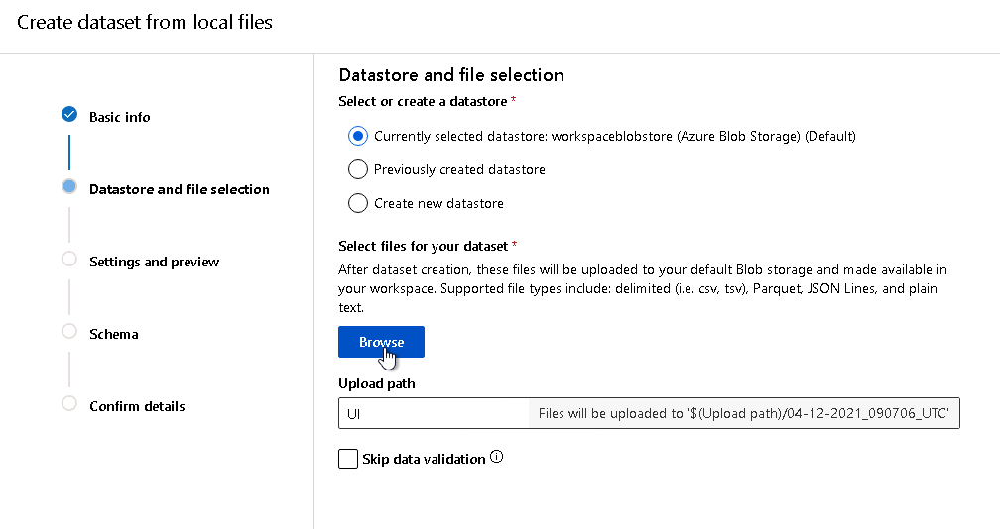
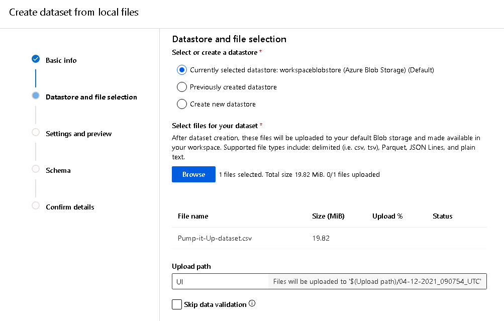
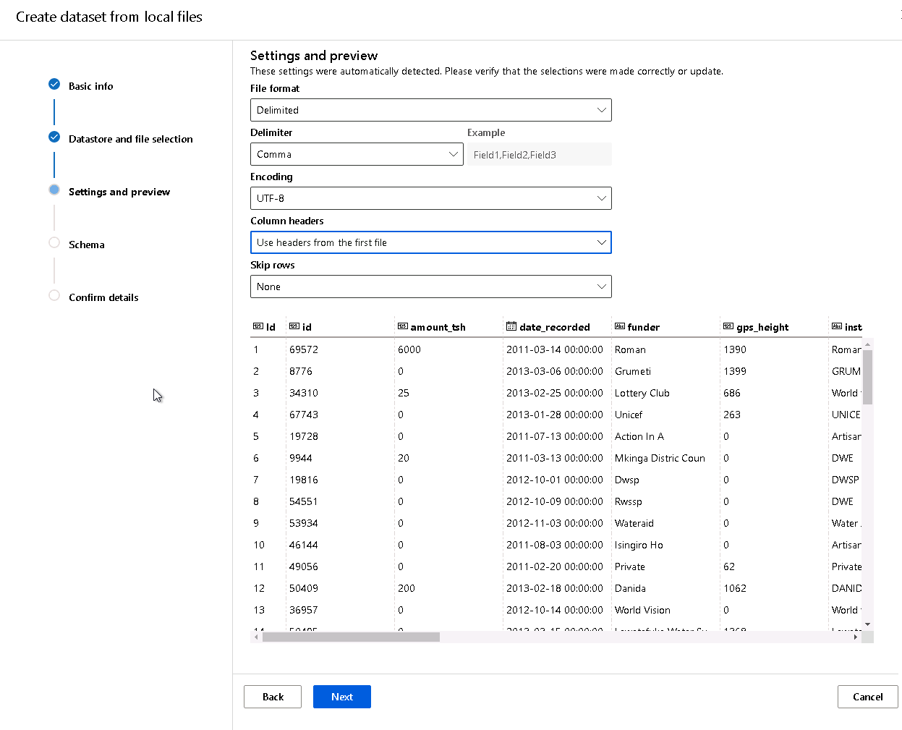
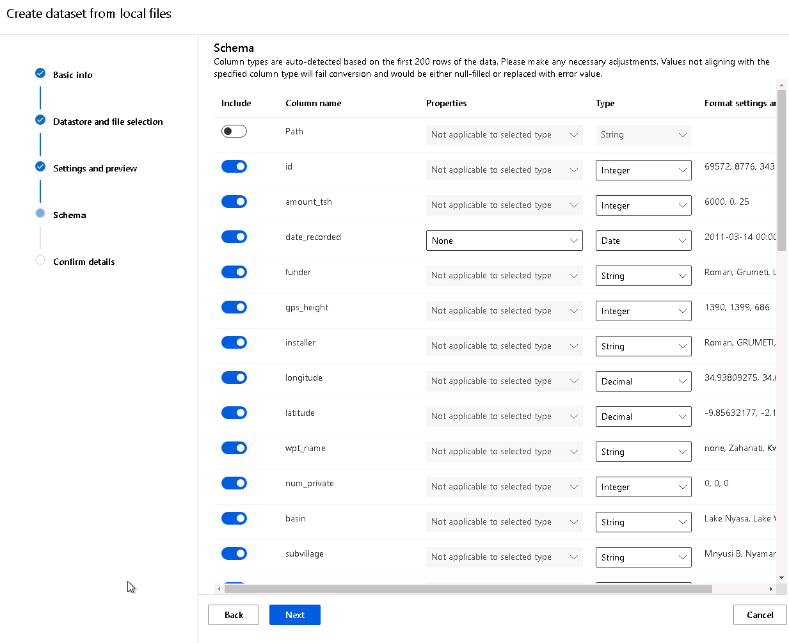
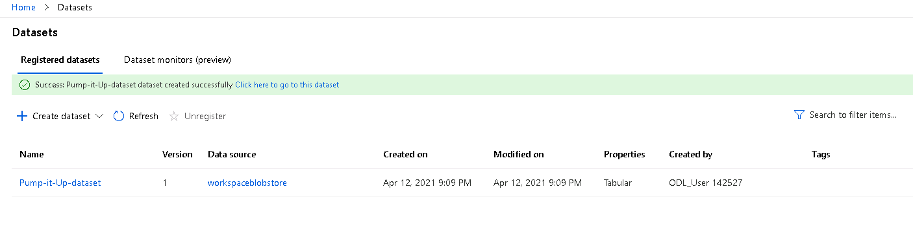

# Hyperdrive vs AutoML + Deployment in AzureML Studio

## Table of Contents
   * [Project Set Up and Installation](#Project-Set-Up-and-Installation)
   * [Dataset](#Dataset)
   * [Overview](#Overview)
   * [Task](#Task)
   * [Access](#Access)
   * [Automated ML](#Automated-ML)
   * [AutoML-Results](#AutoML-Results)
   * [Hyperparameter-Tuning](#Hyperparameter-Tuning)
   * [Hyperparameter-Tuning-Results](#Hyperparameter-Tuning-Results)
   * [Model Deployment](#Model-Deployment)
   * [Screen Recording](#Screen-Recording)
   * [Future Work](#Future-Work)

In this project, we will train a model using HyperDrive to search within a space of hyperparameters for a Random Forest model. We will compare the resulting model with the best model obtained via AutoML. Instead of searching a hyperparameter space, AutoML will test a variety of models with some automatically chosen hyperparameters and see which one works best.

We will be working with the [Pump it Up Dataset](https://www.drivendata.org/competitions/7/pump-it-up-data-mining-the-water-table/page/23/). We've modified the dataset so that it works better in Azure (we concatenated `y_test` to `X_test`).

After we've trained the models, we will deploy the model that performs the best on `recall_score_micro`.

## Project Set Up and Installation

To use this repository, you must import the dataset in AzureML Studio in Datasets, and then import the code in the Notebooks section.

To load a dataset in AzureML Studio, you first must follow these steps:

1. Go to the Datasets page.

2. Click on Create dataset and the appropriate drop-down option. In our case, we're loading the dataset locally. The dataset (which was modified from the DrivenData competition) can be found [here](https://github.com/JayThibs/hyperdrive-vs-automl-plus-deployment/blob/main/Pump-it-Up-dataset.csv).

You will then be asked to give your dataset a name and specify the dataset type. Our dataset is a tabular dataset. Afterwards, click next.

Now, we import the dataset with the Browse button and AzureML Studio will make sure there is no issue with the dataset.

We will now make sure that dataset is being loaded with the correct encoding, delimiters, etc. For our case, we change the Column Headers so that it uses the headers that came with the file (instead of putting the headers as a first row).

Make sure to check that all the columns have the correct type. We don't change anything here.

Click next and your dataset will be loaded into AzureML Studio!

Lastly, we go to the Notebooks page and load the coad from this repository. Click Create and load the folder.

## Dataset

### Overview

The dataset we will be working with is the [Pump it Up Dataset](https://www.drivendata.org/competitions/7/pump-it-up-data-mining-the-water-table/page/23/) from DrivenData.org. The purpose of the dataset is the following:

A preview of the [dataset](https://github.com/JayThibs/hyperdrive-vs-automl-plus-deployment/blob/main/Pump-it-Up-dataset.csv):

### Task

The goal of the dataset is to predict which water pumps are non-functional or need some repair. We will be using this dataset to practice preprocessing data and comparing Automated ML with HyperDrive (hyperparameter search).

We decided to mesure performance on the Recall Score Micro metric because our dataset is imbalanced and we want to make sure we choose a metric where we do not miss any of the True Positives (non-functioning water pumps) since it is worse to miss a non-functioning water pump than a functioning water pump.

The summary of the dataset from the DriveData website is the following:

> Can you predict which water pumps are faulty?

> Using data from Taarifa and the Tanzanian Ministry of Water, can you predict which pumps are functional, which need some repairs, and which don't work at all? This is an intermediate-level practice competition. Predict one of these three classes based on a number of variables about what kind of pump is operating, when it was installed, and how it is managed. A smart understanding of which waterpoints will fail can improve maintenance operations and ensure that clean, potable water is available to communities across Tanzania.

We will be using most of the features in this dataset. However, since there are some features with useless information for prediction or simply too many classes, we will remove some of the following classes during preprocessing:

>'id','amount_tsh',  'num_private', 'quantity', 
'quality_group', 'source_type', 'payment', 
'waterpoint_type_group', 'extraction_type_group', 
'wpt_name', 'subvillage', 'scheme_name', 'funder', 
'installer', 'recorded_by', 'ward'

### Access
*TODO*: Explain how you are accessing the data in your workspace.

## Automated ML
*TODO*: Give an overview of the `automl` settings and configuration you used for this experiment

### Results
*TODO*: What are the results you got with your automated ML model? What were the parameters of the model? How could you have improved it?

*TODO* Remeber to provide screenshots of the `RunDetails` widget as well as a screenshot of the best model trained with it's parameters.

## Hyperparameter Tuning
*TODO*: What kind of model did you choose for this experiment and why? Give an overview of the types of parameters and their ranges used for the hyperparameter search

### Results
*TODO*: What are the results you got with your model? What were the parameters of the model? How could you have improved it?

*TODO* Remeber to provide screenshots of the `RunDetails` widget as well as a screenshot of the best model trained with it's parameters.

## Model Deployment
*TODO*: Give an overview of the deployed model and instructions on how to query the endpoint with a sample input.

## Screen Recording
*TODO* Provide a link to a screen recording of the project in action. Remember that the screencast should demonstrate:
- A working model
- Demo of the deployed  model
- Demo of a sample request sent to the endpoint and its response

## Extra Notes

- AutoML only works for a subset of primary metrics (AUC weighted, Accuracy, Norm macro recall, Average precision score weighted, Precision score weighted). The primary metric we wanted, `recall_score_micro`, was not an option. Therefore, we needed to choose `norm_macro_recall` for the primary metric and then replace the "best" model with the model that performed the best on `recall_score_micro`.
- AutoML does not work with multi-label classification problems (where multiple labels can be predicted for a given input). I wanted to use deep learning on a multi-label classification problem and compare it to AutoML, but I had to settle for a multi-class classification problem (only one label can be predicted) because of AutoML.
- When training data is registered in TabularDatasetFactory, the column headers can change as a result. This happened to me. All periods (“.”) were replaced with underscores (“_”). Therefore, I needed to fix this issue in `X_test`.
