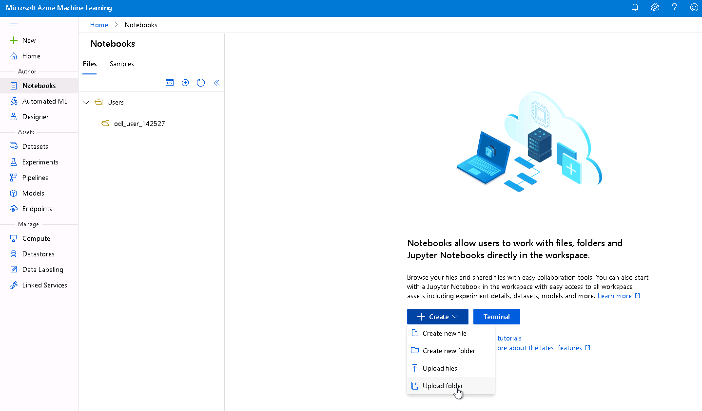
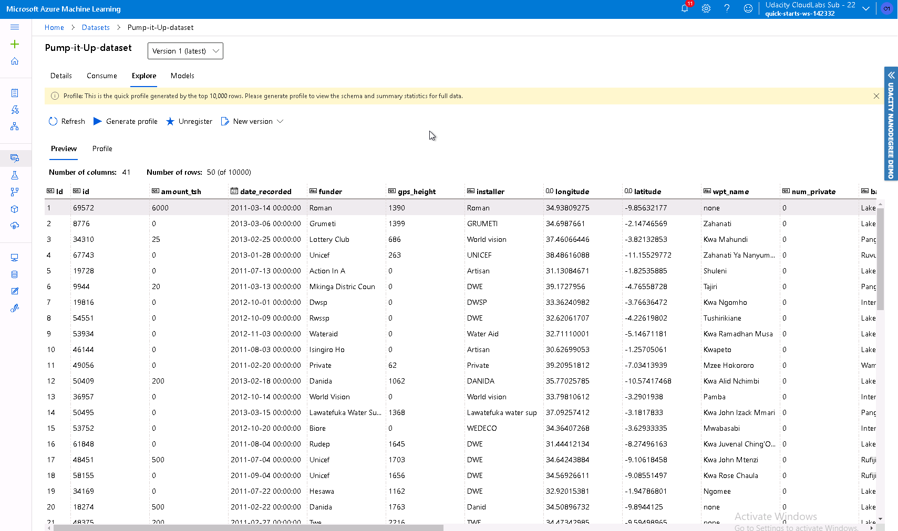
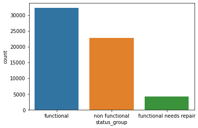

# Hyperdrive vs AutoML + Deployment in AzureML Studio

## Table of Contents
   * [Project Set Up and Installation](#Project-Set-Up-and-Installation)
   * [Dataset](#Dataset)
   * [Overview](#Overview)
   * [Task](#Task)
   * [Access](#Access)
   * [Automated ML](#Automated-ML)
   * [Automated ML Results](#AutoML-Results)
   * [Hyperparameter Tuning with HyperDrive](#Hyperparameter-Tuning-with-HyperDrive)
   * [Hyperparameter Tuning Results](#Hyperparameter-Tuning-Results)
   * [Model Deployment](#Model-Deployment)
   * [Screen Recording](#Screen-Recording)
   * [Useful Notes](#Useful-Notes)

In this project, we will train a model using HyperDrive to search within a space of hyperparameters for a Random Forest model. We will compare the resulting model with the best model obtained via AutoML. Instead of searching a hyperparameter space, AutoML will test a variety of models with some automatically chosen hyperparameters and see which one works best.

We will be working with the [Pump it Up Dataset](https://www.drivendata.org/competitions/7/pump-it-up-data-mining-the-water-table/page/23/). We've modified the dataset so that it works better in Azure (we concatenated `y_test` to `X_test`).

After we've trained the models, we will deploy the model that performs the best on `recall_score_micro`.

Note: A Colab version of the project (minus the deployment) can be found [here](https://github.com/JayThibs/hyperdrive-vs-automl-plus-deployment/blob/main/Tanzania_Competition_Colab_Version.ipynb). The Colab version was created for data exploration and testing before working in AzureML Studio.

## Project Set Up and Installation

To use this repository, all you need to do is download the code repository and load it into the Notebooks page of AzureML Studio. Afterwards, you can simply run either the [HyperDrive Notebook](https://github.com/JayThibs/hyperdrive-vs-automl-plus-deployment/blob/main/hyperparameter_tuning.ipynb) or the [AutoML (plus deployment) Notebook](https://github.com/JayThibs/hyperdrive-vs-automl-plus-deployment/blob/main/automl.ipynb).

Load the Notebooks page and load the code from this repository. Click Create and load the folder.

## Dataset

### Overview

The dataset we will be working with is the [Pump it Up Dataset](https://www.drivendata.org/competitions/7/pump-it-up-data-mining-the-water-table/page/23/) from DrivenData.org. The purpose of the dataset is the following:

A preview of the [dataset](https://github.com/JayThibs/hyperdrive-vs-automl-plus-deployment/blob/main/Pump-it-Up-dataset.csv):

We can see here that there is a class imbalance in the dataset's target variable (especially for the "functional needs repair" label):

These are the features of the dataset:

    amount_tsh - Total static head (amount water available to waterpoint)
    date_recorded - The date the row was entered
    funder - Who funded the well
    gps_height - Altitude of the well
    installer - Organization that installed the well
    longitude - GPS coordinate
    latitude - GPS coordinate
    wpt_name - Name of the waterpoint if there is one
    num_private -
    basin - Geographic water basin
    subvillage - Geographic location
    region - Geographic location
    region_code - Geographic location (coded)
    district_code - Geographic location (coded)
    lga - Geographic location
    ward - Geographic location
    population - Population around the well
    public_meeting - True/False
    recorded_by - Group entering this row of data
    scheme_management - Who operates the waterpoint
    scheme_name - Who operates the waterpoint
    permit - If the waterpoint is permitted
    construction_year - Year the waterpoint was constructed
    extraction_type - The kind of extraction the waterpoint uses
    extraction_type_group - The kind of extraction the waterpoint uses
    extraction_type_class - The kind of extraction the waterpoint uses
    management - How the waterpoint is managed
    management_group - How the waterpoint is managed
    payment - What the water costs
    payment_type - What the water costs
    water_quality - The quality of the water
    quality_group - The quality of the water
    quantity - The quantity of water
    quantity_group - The quantity of water
    source - The source of the water
    source_type - The source of the water
    source_class - The source of the water
    waterpoint_type - The kind of waterpoint
    waterpoint_type_group - The kind of waterpoint

We will be using most of the features in this dataset. However, since there are some features with useless information for prediction or simply too many classes, we will remove some of the following classes during preprocessing:

>'id', 'amount_tsh',  'num_private', 'quantity', 
'quality_group', 'source_type', 'payment', 
'waterpoint_type_group', 'extraction_type_group', 
'wpt_name', 'subvillage', 'scheme_name', 'funder', 
'installer', 'recorded_by', 'ward'

### Task

The goal of the dataset is to predict which water pumps are non-functional or need some repair. We will be using this dataset to practice preprocessing data and comparing Automated ML with HyperDrive (hyperparameter search).

We decided to mesure performance on the Recall Score Micro metric because our dataset is imbalanced and we want to make sure we choose a metric where we do not miss any of the True Positives (non-functioning water pumps) since it is worse to miss a non-functioning water pump than a functioning water pump.

The summary of the dataset from the DriveData website is the following:

> Can you predict which water pumps are faulty?

> Using data from Taarifa and the Tanzanian Ministry of Water, can you predict which pumps are functional, which need some repairs, and which don't work at all? This is an intermediate-level practice competition. Predict one of these three classes based on a number of variables about what kind of pump is operating, when it was installed, and how it is managed. A smart understanding of which waterpoints will fail can improve maintenance operations and ensure that clean, potable water is available to communities across Tanzania.

### Access

The dataset is loaded in the notebooks with the following line of code:

    from azureml.core import Workspace, Dataset
    
    ws = run.experiment.workspace

    key = 'Pump-it-Up-dataset'

    if key in ws.datasets.keys():
          dataset = ws.datasets[key]
          print('dataset found!')

    else:
          url = 'https://raw.githubusercontent.com/JayThibs/hyperdrive-vs-automl-plus-deployment/main/Pump-it-Up-dataset.csv'
          dataset = Dataset.Tabular.from_delimited_files(url)
          datatset = dataset.register(ws, key)

    dataset.to_pandas_dataframe()

## Automated ML

We used the following setting with the Automated ML approach:

    "experiment_timeout_minutes": 120, # to set a limit on the amount of time AutoML will be running, needs to be higher depending on dataset size
    "max_concurrent_iterations": 5, # applies to the compute target we are using
    "primary_metric" : 'norm_macro_recall' # recall for our performance metric, though not the actual metric we will be measuring performance
    enable_early_stopping = True
    featurization = 'auto'

### Automated ML Results
*TODO*: What are the results you got with your automated ML model? What were the parameters of the model? How could you have improved it?

As we can see in the screenshot below, we grabbed the model that performed the best on `recall_score_micro` (instead of the primary metric).

*TODO* Remeber to provide screenshots of the `RunDetails` widget as well as a screenshot of the best model trained with it's parameters.

Here are the Run Details of the AutoML run:

## Hyperparameter Tuning with HyperDrive
*TODO*: What kind of model did you choose for this experiment and why? Give an overview of the types of parameters and their ranges used for the hyperparameter search

For this tabular dataset, we've decided to use a Random Forest algorithm since it performs great for these types of problems and doesn't require too much modifications.

With HyperDrive, we used Bayesian Search Optimization to find the best hyperparameters for the Random Forest model. Here's the hyperparameter space we decided to search:

    'max_depth': quniform(3, 12, 3), # Maximum depth of the trees, (3, 6, 9, 12)
    'min_samples_split': choice(4, 6), # Minimum number of samples required to split
    'n_estimators' : choice(500, 750, 1000) # Number of trees

### Hyperparameter Tuning Results

In the screenshot below, we can see that our best Random Forest model with HyperDrive has a `recall_score_micro` of 0.765 and has the following hyperparameters:

> max_depth = 12
> min_samples_split = 6
> n_estimators = 500

We can see the HyperDrive Run page here:

To improve model performance: I was able to achieve a higher performance by using the Colab notebook (Recall Micro with Random Forest: 0.812). This is because it was much quicker to code in Colab, even after doing my own parameter search. I was able to find the optimal hyperparameters for the random forest model much quicker. I'm sure I could have achieved similar performance with HyperDrive had I spend more time tuning the hyperparameters. But this project was more about comparing two methods of model development and deploying the best one. Though I could have saved the model.pkl of the RF model in Colab and deployed in Azure, I was more interested in deploying AutoML.

In other words, the model could be improved if more time was spent on the hyperparameter search.

Here are the Run Details of the HyperDrive run:

We can see here that HyperDrive provides some visualizations to compare all the child runs:

## Model Deployment
*TODO*: Give an overview of the deployed model and instructions on how to query the endpoint with a sample input.

Since the XGBoost AutoML model performed the best out of all the models, this is the model we chose to deploy.

## Screen Recording
[Here's a link to a Screen Recording describing the project.](https://youtu.be/t5tNFa0WgBk)

## Useful Notes

- AutoML only works for a subset of primary metrics (AUC weighted, Accuracy, Norm macro recall, Average precision score weighted, Precision score weighted). The primary metric we wanted, `recall_score_micro`, was not an option. Therefore, we needed to choose `norm_macro_recall` for the primary metric and then replace the "best" model with the model that performed the best on `recall_score_micro`.
- AutoML does not work with multi-label classification problems (where multiple labels can be predicted for a given input). I wanted to use deep learning on a multi-label classification problem and compare it to AutoML, but I had to settle for a multi-class classification problem (only one label can be predicted) because of AutoML.
- When training data is registered in TabularDatasetFactory, the column headers can change as a result. This happened to me. All periods (“.”) were replaced with underscores (“_”). Therefore, I needed to fix this issue in `X_test`.
